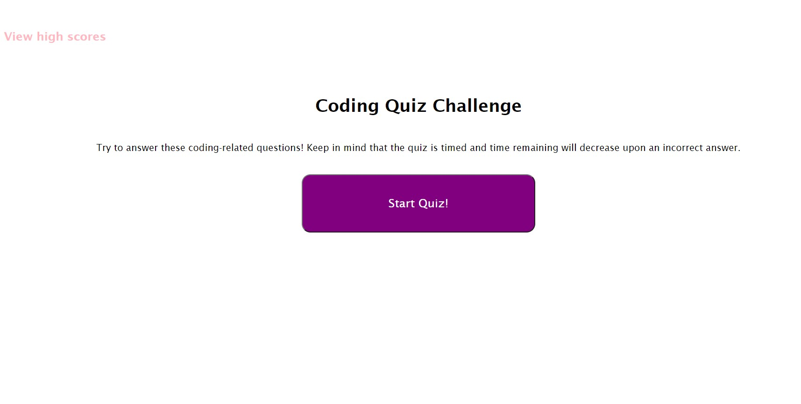

# Javascript Quiz
The purpose of this project was to create a quiz on Javascript-related questions that updates scores and saves them in localStorage. Additionally, the quiz is timed and the timer will decrease in the event that an incorrect answer is clicked. Players will be able to enter their initials and it will be saved with their score for the next payer to access via the high scores list. 

## Key features
- DOM interactivity 
- Click events
- Timers
- Javascript interactivity and styling

## Written in
- Javascript
- HTML 
- CSS 

Site deployed at [Code Quiz](https://aucoats.github.io/codequiz-challenge) 

